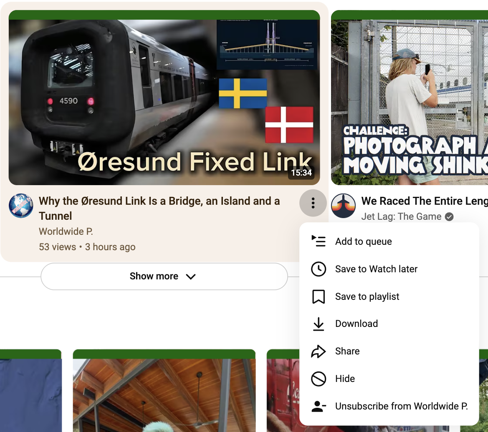

# YouTube Feed Unsubscribe

A tiny userscript that adds **Unsubscribe from ‹channel›** to the ⋮ menu on videos in your [YouTube subscriptions feed](https://www.youtube.com/feed/subscriptions). You can prune your subscriptions while you scroll, without opening each channel page.

## Install

1. Install a userscript manager: [Tampermonkey](https://www.tampermonkey.net/) (Chrome, Firefox, Safari, Edge) or [Violentmonkey](https://violentmonkey.github.io/).
   - On Chrome, you also need to turn on **Allow User Scripts** in the extension's details page (`chrome://extensions` → Tampermonkey → Details).
2. **[Click here to install the script](https://raw.githubusercontent.com/MatRanc/yt-feed-unsubscribe/main/yt-feed-unsubscribe.user.js)** and accept the prompt.
3. Open <https://www.youtube.com/feed/subscriptions>, click ⋮ on any video, and choose **Unsubscribe from …**.

Tampermonkey checks this repo for updates automatically.

## How it works

- When you click ⋮ on a video card in the subscriptions feed, the script reads the channel link (`/@handle`) from that card.
- It adds a row to YouTube's own popup by cloning the existing **Hide** row, so it matches the theme (light or dark) and the font.
- Clicking the row asks you to confirm. It then calls the same internal API that YouTube's own Subscribe button uses (`youtubei/v1/subscription/unsubscribe`), authenticated with your existing session cookie, and hides that channel's videos from the feed you're looking at.

Nothing is sent anywhere except `youtube.com`. The script has no dependencies and uses `@grant none`.

## Limitations

- It only runs on `/feed/subscriptions`. Shorts cards don't include a channel link, so they don't get the menu item.
- YouTube changes its markup often. If the item stops appearing, [open an issue](https://github.com/MatRanc/yt-feed-unsubscribe/issues).

## License

MIT
